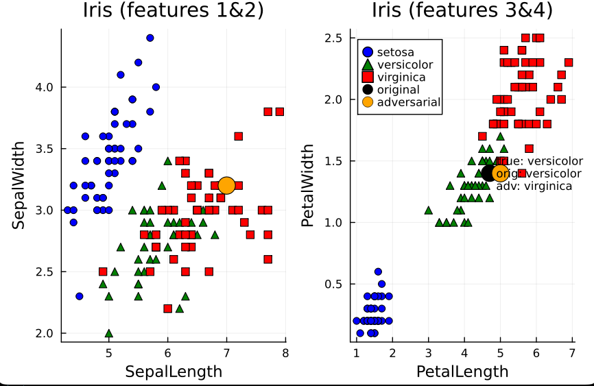

# Black-Box – Basic Random Search (DecisionTree, Iris)

This tutorial demonstrates a **black‑box** adversarial attack using Basic Random Search on a decision tree trained on the Iris dataset. Unlike the MNIST example, the attack only relies on model queries and does not use gradients or internal parameters.

### What the script does

- Trains a `DecisionTreeClassifier` on the four Iris features (sepal length/width, petal length/width) with a limited maximum depth.
- Picks a correctly classified sample and constructs a `(data, label)` pair compatible with the `craft` API.
- Runs a `BasicRandomSearch` attack with feature‑wise bounds, searching for a nearby point that reduces the true‑class probability and potentially changes the predicted class.

### Visual summary

The resulting adversarial effect in feature space is summarized with:

The figure consists of two scatter plots:

- **Left (features 1 & 2)**: Sepal length vs sepal width, showing all Iris samples with different markers for *setosa*, *versicolor*, and *virginica*. In this projection the original and adversarial points almost overlap, because the attack changes features 1 and 2 only minimally.
- **Right (features 3 & 4)**: Petal length vs petal width, again with class‑specific markers, and two highlighted points for the **original** sample and its **adversarial** counterpart.

The annotation in the right panel indicates the true class, the original prediction, and the adversarial prediction (for example, true: *versicolor*, original: *versicolor*, adversarial: *virginica*), making it clear how a small move in the feature space can cross the decision boundary of the tree in a purely query‑based setting.